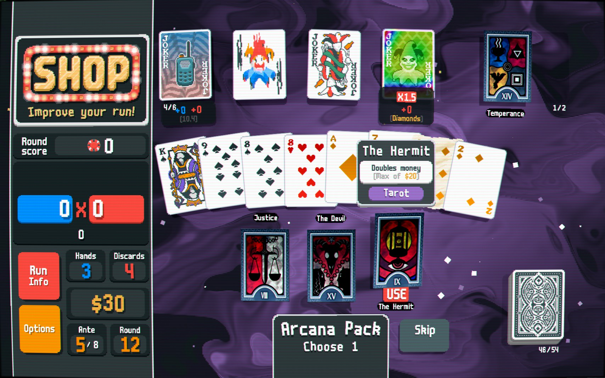
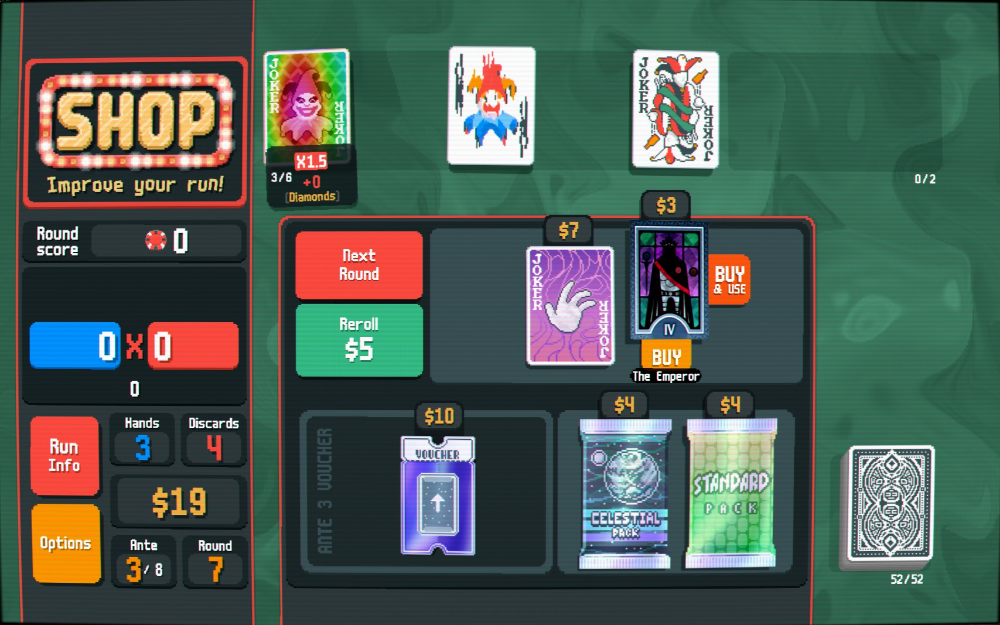
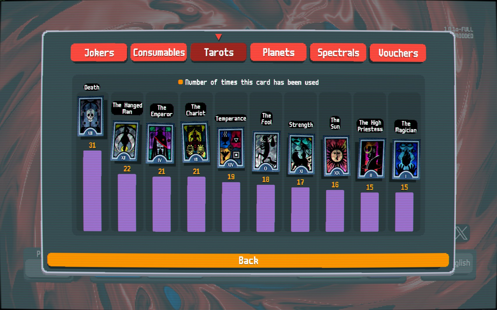

# TarotLabels

Overlays each tarot card's name directly on the card art. Useful when using skin mods that don't print names on the artwork.






## Requirements

- [Balatro](https://www.playbalatro.com/)
- [Steamodded](https://github.com/Steamodded/smods) (SMODS 1.x)

## Install

Drop the `TarotLabels` folder into your mods directory:

```
%AppData%\Roaming\Balatro\Mods\
```

## Label Placement

The label repositions itself depending on where the card is and whether it is selected, so it never covers game UI elements.

| Location | Idle | When Selected |
|---|---|---|
| Hand / consumable slot | Bottom (close) | Bottom (close) |
| Shop | Bottom (close) | Bottom (far) - clears the BUY button |
| Pack selection | Top | Bottom (far) - clears the USE button |
| Career stats screen | Top, two lines | Top, two lines |

Long names such as "The High Priestess" are split into two balanced lines on the stats screen where the histogram columns are narrow.

## Compatibility

Works with any tarot skin mod. The label reads the game's own card name data, not the artwork, so it picks up the correct name regardless of which skin is active.

## Tarot skin used in screenshots

The card art shown above uses the [Persona 3 Tarot skin](https://www.nexusmods.com/balatro/mods/70) available on Nexus Mods.
